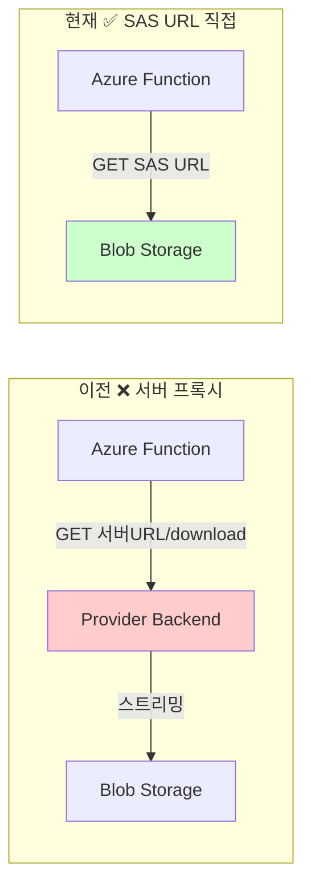
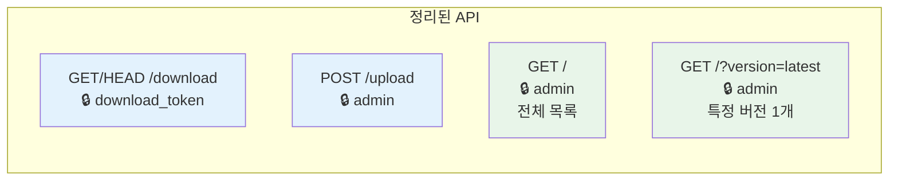

# 🔄 OTA 에이전트 업데이트 기능 구현 문서

관리자가 프론트엔드에서 최신 버전을 확인하고, 버튼 클릭 한 번으로 배포된 에이전트를 원격 업데이트하는 기능.

## 시스템 아키텍처

```
 ┌─────────────────────────────────────────────────────────────────────┐
 │                        OTA Update Flow                              │
 │                                                                     │
 │  ┌──────────┐    ┌───────────────┐    ┌──────────┐    ┌──────────┐ │
 │  │ GitHub   │───▶│ Provider      │◀──▶│ Frontend │    │ Azure    │ │
 │  │ Actions  │    │ Backend       │    │ (Teams)  │    │ ARM API  │ │
 │  │          │    │               │    │          │    │          │ │
 │  │ CI/CD    │    │ • 패키지 저장  │    │ • 버전표시 │    │ • 설정   │ │
 │  │ 빌드/배포 │    │ • 버전 관리   │    │ • 업데이트 │    │   변경   │ │
 │  │          │    │ • SAS URL    │    │   버튼    │    │ • 자동   │ │
 │  └──────────┘    └───────────────┘    └──────────┘    │   재시작  │ │
 │       │                  │                  │          └──────────┘ │
 │       ▼                  ▼                  │               │       │
 │  ┌──────────┐    ┌───────────────┐          │         ┌──────────┐ │
 │  │ agent-   │    │  Blob Storage │          │         │ Function │ │
 │  │ v1.1.0   │    │  (패키지 저장) │◀─── SAS URL ────▶│ App      │ │
 │  │ .zip     │    │              │           │         │ (에이전트)│ │
 │  └──────────┘    └───────────────┘          │         └──────────┘ │
 └─────────────────────────────────────────────────────────────────────┘
```

---

## 업데이트 플로우

```mermaid
sequenceDiagram
    participant Admin as 👤 관리자
    participant FE as 🖥️ Frontend
    participant PB as ⚙️ Provider Backend
    participant BS as 📦 Blob Storage
    participant ARM as ☁️ Azure ARM API
    participant FA as 🤖 Function App

    Note over Admin,FA: 1️⃣ 패키지 빌드 및 업로드 (CI/CD)
    rect rgb(240, 248, 255)
        Admin->>Admin: git tag v1.1.0 && git push --tags
        Note right of Admin: GitHub Actions 트리거
        Admin->>PB: CI: POST /packages/upload (agent-v1.1.0.zip)
        PB->>BS: Blob 저장
        PB-->>Admin: ✅ 패키지 저장 완료
    end

    Note over Admin,FA: 2️⃣ 관리자가 업데이트 확인 및 실행
    rect rgb(255, 248, 240)
        Admin->>FE: 에이전트 관리 페이지 접속
        FE->>PB: GET /packages?version=latest
        PB-->>FE: {version: "1.1.0", filename: "agent-v1.1.0.zip"}
        FE->>FE: 에이전트 v1.0.0 vs 패키지 v1.1.0 비교
        FE-->>Admin: "v1.1.0 업데이트 가능" 표시
        Admin->>FE: 🔄 업데이트 버튼 클릭
        FE->>PB: POST /agents/{id}/request-update
    end

    Note over Admin,FA: 3️⃣ SAS URL 생성 + ARM API 설정 변경
    rect rgb(240, 255, 240)
        PB->>BS: SAS URL 생성 (30일 유효)
        PB->>PB: OBO 토큰 교환
        PB->>ARM: PUT .../appsettings (WEBSITE_RUN_FROM_PACKAGE = SAS URL)
        ARM-->>PB: 200 OK
        PB-->>FE: {success: true, message: "업데이트 시작됨"}
        FE-->>Admin: ✅ "업데이트가 시작되었습니다"
    end

    Note over Admin,FA: 4️⃣ 에이전트 재시작 (직접 다운로드)
    rect rgb(248, 240, 255)
        ARM->>FA: ⚡ 자동 재시작 트리거
        FA->>BS: SAS URL로 직접 다운로드 (서버 경유 없음!)
        BS-->>FA: agent-v1.1.0.zip
        FA->>FA: VERSION 파일 읽기 → "1.1.0"
        FA->>PB: Handshake (version: "1.1.0")
    end
```



---

## 다운로드 방식 (Before → After)



---

## 패키지 API 구조



---

## 변경 파일 트리

```
 log-doctor/
 ├── log-doctor-client-back/              ← 에이전트
 │   ├── VERSION                          [NEW] 버전 단일 소스
 │   ├── .github/workflows/deploy.yml     [MOD] 태그 기반 버전 zip
 │   ├── scripts/verify_package.sh        [MOD] 버전 파일명 통일
 │   └── agent/core/config.py             [MOD] VERSION 동적 로드
 │
 ├── log-doctor-provider-back/            ← 공급자 백엔드
 │   ├── app/domains/package/
 │   │   ├── models.py                    [MOD] version 필드
 │   │   ├── repository.py                [MOD] semver 정렬 + generate_download_url()
 │   │   └── router.py                    [MOD] /latest, /{ver} 삭제 → ?version= 통합
 │   ├── app/domains/agent/
 │   │   ├── router.py                    [MOD] base_url 제거
 │   │   ├── schemas.py                   [MOD] 업데이트 스키마
 │   │   ├── dependencies.py              [MOD] UseCase DI
 │   │   └── usecases/
 │   │       └── request_agent_update_    [NEW] SAS URL 기반 OTA 로직
 │   │           use_case.py
 │   └── app/infra/external/azure/
 │       └── azure_resource_service.py    [MOD] update_function_app_settings()
 │
 └── log-doctor-provider-front/           ← 프론트엔드
     └── src/
         ├── shared/api/endpoints.ts      [MOD] ?version=latest
         └── features/home/
             ├── hooks/useAgentSetupFlow  [MOD] requestUpdate(), fetchLatestPackage()
             └── components/subscription/
                 └── SubscriptionItem.tsx [MOD] 버전 표시 + 업데이트 버튼
```

---

## 커밋 내역 (총 8개)

| #   | 프로젝트       | 커밋 메시지                                             |
| --- | -------------- | ------------------------------------------------------- |
| 1   | client-back    | Feat: VERSION + deploy.yml + config.py                  |
| 2   | provider-back  | Feat: PackageInfo version 필드 + semver 정렬            |
| 3   | provider-back  | Feat: AzureResourceService update_function_app_settings |
| 4   | provider-back  | Feat: RequestAgentUpdateUseCase + 라우터                |
| 5   | provider-front | Feat: 버전 표시 + 업데이트 버튼 UI                      |
| 6   | provider-back  | Refactor: 패키지 라우터 정리                            |
| 7   | provider-back  | Feat: generate_download_url() 추가                      |
| 8   | provider-back  | Refactor: OTA에서 SAS URL 사용                          |

---

## 배포 후 해야 할 것

### 1. provider-back 배포

```bash
# 변경된 provider-back 코드를 배포
git push origin dev
```

### 2. 에이전트 패키지 업로드 (최초 1회)

```bash
# v1.0.0 태그로 CI/CD 실행하여 agent-v1.0.0.zip 빌드 후 업로드
# 또는 수동으로:
curl -X POST https://provider-url/api/v1/packages/upload \
  -H "Authorization: Bearer <admin-token>" \
  -F "file=@agent-v1.0.0.zip"
```

### 3. provider-front 배포

```bash
# endpoints.ts 변경 반영
git push origin feat/yoonsik-practice
```

### 4. E2E 테스트

1. 프론트에서 에이전트 버전 확인 (v1.0.0 표시되는지)
2. 새 버전 패키지 업로드 (agent-v1.1.0.zip)
3. 프론트에서 "업데이트" 버튼 노출 확인
4. 업데이트 클릭 → Function App 재시작 확인
5. 핸드쉐이크에서 새 버전 보고 확인

### 5. Blob Storage 확인

- `AZURE_STORAGE_CONNECTION_STRING`에 **AccountKey**가 포함되어 있는지 확인
- 없으면 SAS URL 생성 불가 → 서버 프록시로 폴백됨 (로그에 경고 출력)
