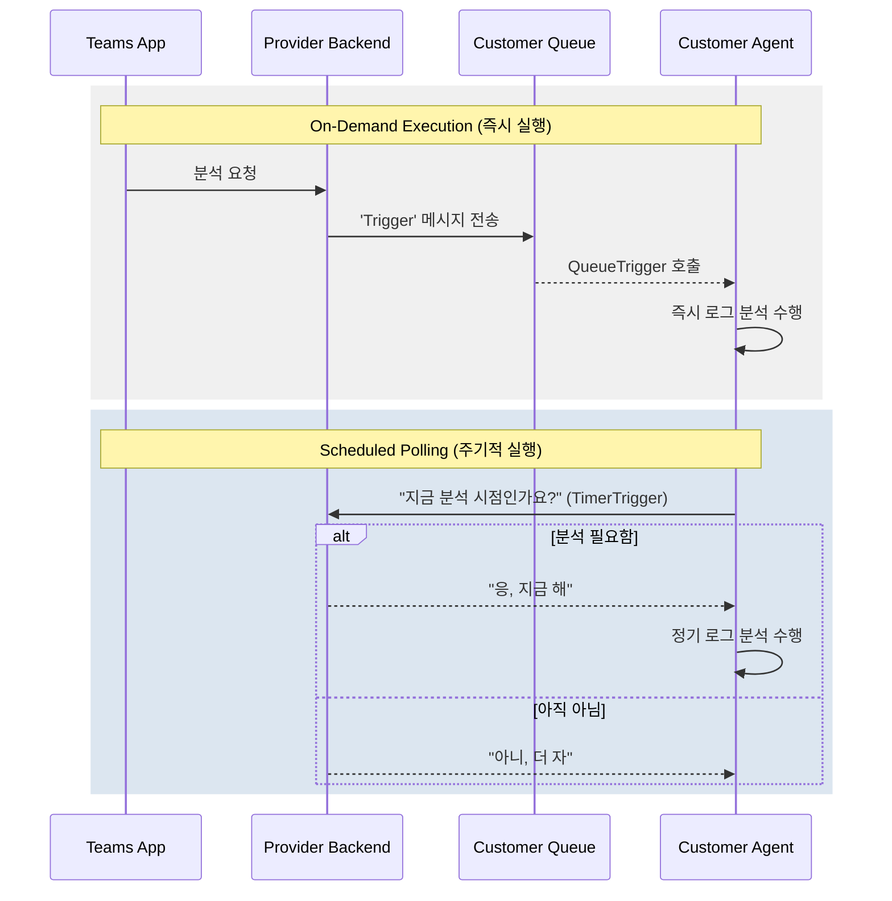
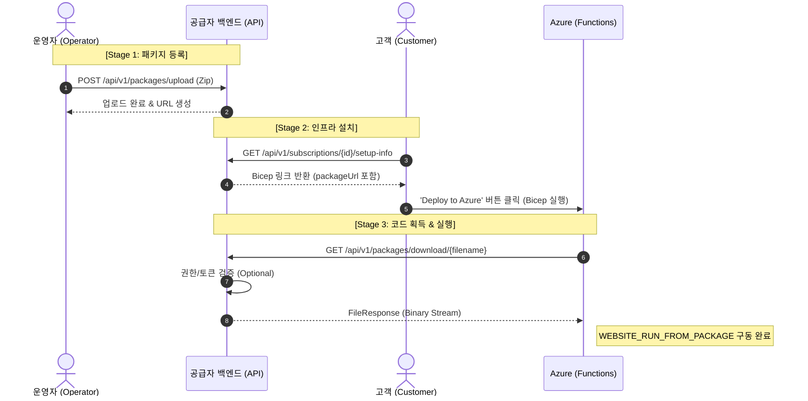

# 에이전트 아키텍처: 지능형 트리거 및 동적 스케줄링 전략

본 문서는 Log Doctor 에이전트의 하이브리드 배포 아키텍처와 지능형 제어 시스템에 대한 기술적 세부 사항을 담고 있습니다.

## 1. 개요 (Overview)

고객사 Azure 환경의 보안 제약사항을 준수하면서도, 공급자(Provider)가 에이전트의 실행 주기와 방식을 유연하게 제어할 수 있는 **지능형 트리거 시스템**을 구축합니다.

### 핵심 목표

- **최소 권한(Least Privilege)**: 고객사 Azure 인프라 설정을 변경하지 않고 에이전트 동작 제어.
- **실시간성 & 효율성**: 큐(Queue)를 통한 즉각 실행과 타이머(Timer)를 통한 정기 폴링의 조화.
- **원격 배포(Remote Deployment)**: 별도 리포지토리의 에이전트 코드를 패키지 URL을 통해 자동 배포.

---

## 2. 시스템 아키텍처

### 데이터 및 명령 흐름도

```text
     _______________________________________________________
    |                                                       |
    |    LOG DOCTOR: HYBRID DEPLOYMENT ARCHITECTURE         |
    |_______________________________________________________|
               |                               |
        [ PROVIDER HUB ]               [ CUSTOMER EDGE ]
               |                               |
        +--------------+               +---------------+
        | Backend API  | <---(Poll)--- | Azure Agent   |
        +--------------+               +---------------+
               |                               |
        [ Teams App ] -------(Push)------> [ Queue ]
```

### 시퀀스 다이어그램



---

## 3. 구현 세부 사항

### 3.1. 지능형 트리거 매커니즘

에이전트는 두 가지 경로를 통해 활성화됩니다.

1.  **QueueTrigger (즉시 실행)**: 사용자가 분석 버튼을 클릭하면 백엔드가 고객사 Storage Queue에 메시지를 전송합니다. 에이전트는 이를 감지하여 즉각 깨어납니다.
2.  **TimerTrigger (정기 폴링)**: 에이전트는 고정된 주기(예: 30분)마다 백엔드에 문의합니다. 백엔드는 DB의 사용자 설정을 확인하여 분석 수행 여부를 결정합니다.

### 3.2. RESTful API 디자인

에이전트 리소스 수정을 위해 객체 지향적인 REST API를 제공합니다.

- **Endpoint**: `PATCH /api/v1/agents/{agent_id}`
- **기능**: 스케줄(`analysis_schedule`), 상태(`status`), 버전(`version`) 등 에이전트의 모든 속성을 부분 업데이트(Partial Update)할 수 있습니다.

### 3.3. DDD 기반 도메인 모델링

비즈니스 정합성을 위해 모든 상태 변경 로직은 `Agent` 도메인 엔티티 내부로 캡슐화되어 있습니다.

- **캡슐화**: `agent.update()` 메서드가 필드 간의 일관성과 `updated_at` 갱신을 책임집니다.
- **응집도**: UseCase는 흐름 제어에만 집중하며, 실제 도메인 로직은 모델 내부에서 처리됩니다.

---

## 4. 에이전트 통합 배포 생명주기 (Integrated Deployment Lifecycle)

에이전트의 생명주기는 운영자의 업로드로부터 시작하여 고객의 인프라 배포, 그리고 Azure의 바이너리 획득으로 이어지는 통합 루프로 관리됩니다.

### 4.1. 역할별 배포 흐름 아키텍처

```text
 [ 운영자 (Operator) ]        [ 공급자 백엔드 (Provider) ]       [ 고객 & Azure (Customer) ]
          |                          |                               |
 (1) Zip 업로드 -------------------->|                               |
     (POST /packages/upload)         |                               |
          |                          | (2) 설치 정보 생성            |
          |                          |     (Bicep Link + URL)        |
          |                          |                               |
          |                          |<---- (3) 설치 링크 요청 ------| (마이페이지/메일)
          |                          |------------------------------>|
          |                          |     (4) 'Deploy to Azure'     |
          |                          |                               |
          |                          |          [ Azure Portal ]     |
          |                          |                 |             |
          |                          |<-- (5) 패키지 스트리밍 요청 --| (WebSite_Package_URL)
          |                          |     (GET /packages/download)  |
          |                          |------------------------------>|
          |                          |        (6) 에이전트 구동      |
```

### 4.2. 통합 배포 시퀀스 다이어그램



---

## 5. 인프라 구성 (Infrastructure)

- **Runtime**: Python 3.11 / Linux Consumption Plan
- **Resources**:
  - **Azure Functions**: 에이전트 로직 실행
  - **Storage Queue**: `analysis-requests` 큐를 통한 비동기 명령 전달
  - **Run From Package**: `WEBSITE_RUN_FROM_PACKAGE` 설정을 통한 원격 코드 배포

---

## 5. 비용 및 확장성

- **비용 최적화**: 30분 주기의 폴링은 Azure Functions의 무료 제공량 내에서 충분히 소화되므로 고객 비용 부담이 거의 없습니다.
- **수평 확장**: 에이전트 요청 분산을 위해 Jitter(랜덤 오차)를 적용하며, 공급자 백엔드는 컨테이너 앱(ACA)의 오토스케일링을 통해 수만 개의 요청을 처리합니다.

---

## 6. 에이전트 비활성화 생명주기 (Deactivation Lifecycle)

에이전트 제거 시 고객사 Azure 리소스 그룹을 삭제한 후, 백엔드에서 소프트 딜리트 처리합니다.

### 상태 전이

```
ACTIVE / INITIALIZING → DEACTIVATING → DELETED
                                    → DEACTIVATE_FAILED (실패 시)
```

### 3단계 API

| API                                  | 역할                                        |
| :----------------------------------- | :------------------------------------------ |
| `DELETE /agents/{id}`                | OBO 토큰으로 Azure 삭제 요청 + DEACTIVATING |
| `GET /agents/{id}/azure-status`      | Managed Identity로 리소스 그룹 존재 확인    |
| `POST /agents/{id}/confirm-deletion` | 삭제 확인 후 DELETED 확정                   |

> 상세 설계는 [agent-deactivation.md](./agent-deactivation.md) 참조
