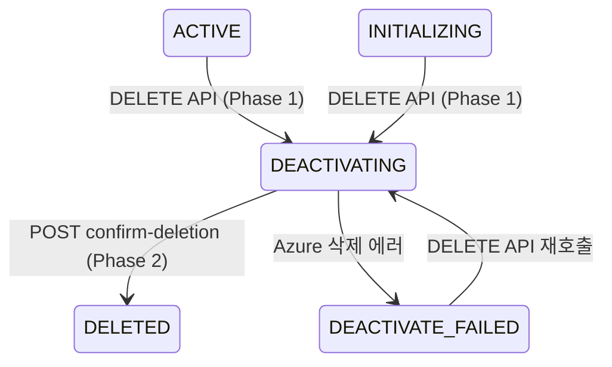
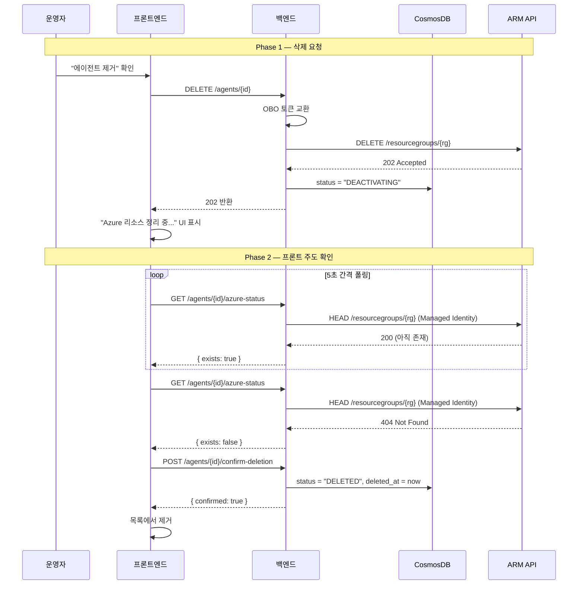
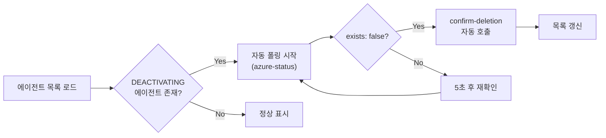

# 에이전트 비활성화 (Deactivation) 설계 문서

## 1. 개요

에이전트 비활성화는 고객사 Azure 리소스 그룹을 삭제하고, 백엔드 DB에서 소프트 딜리트 처리하는 기능입니다.

### 핵심 원칙

- **안전한 2단계 삭제**: Azure 리소스 삭제 확인 후 DB 상태 전환
- **비동기 처리**: API 즉시 반환 → 프론트 폴링으로 완료 확인
- **서비스 추상화**: `AzureResourceService` 인터페이스로 인프라 계층 분리

---

## 2. 시스템 구성

```text
 ┌──────────────────────────────────────────────────────────────────────┐
 │                   AGENT DEACTIVATION ARCHITECTURE                    │
 └──────────────────────────────────────────────────────────────────────┘

  [ 운영자 ]         [ Provider Backend ]        [ Customer Azure ]
      │                      │                          │
 (1) 제거 요청 ────────────► │                          │
      │                      │ ─── OBO Token ──────────►│
      │                      │   DELETE /resourcegroups  │
      │                      │◄──── 202 Accepted ───────│
      │◄─── 202 즉시 반환 ── │                          │
      │                      │                          │
  [DEACTIVATING]             │     [리소스 삭제 진행]    │
      │                      │                          │
 (2) 상태 폴링 ────────────► │                          │
      │                      │ ─── Managed Identity ───►│
      │                      │   HEAD /resourcegroups    │
      │◄─ { exists: false }─ │◄──── 404 Not Found ─────│
      │                      │                          │
 (3) 삭제 확정 ────────────► │                          │
      │                      │ ─── DB: DELETED ──────── │
      │◄── { confirmed } ─── │                          │
```

---

## 3. API 설계

| API                                | 메서드 | 역할                                   | 인증             |
| :--------------------------------- | :----- | :------------------------------------- | :--------------- |
| `/v1/agents/{id}`                  | DELETE | Azure 삭제 요청 + `DEACTIVATING` 마킹  | OBO 토큰         |
| `/v1/agents/{id}/azure-status`     | GET    | 리소스 그룹 존재 여부 확인 (순수 읽기) | Managed Identity |
| `/v1/agents/{id}/confirm-deletion` | POST   | `DELETED` 최종 전환                    | Managed Identity |

### 토큰 전략

```text
┌────────────────────┐    ┌─────────────────┐    ┌──────────────────┐
│   Phase 1 (DELETE) │    │  Phase 2a (GET)  │    │  Phase 2b (POST) │
│                    │    │                  │    │                  │
│  OBO Token 사용    │    │  Managed Identity│    │  Managed Identity│
│  (사용자 세션 필요)│    │  (세션 불필요)   │    │  (세션 불필요)   │
└────────────────────┘    └─────────────────┘    └──────────────────┘
```

---

## 4. 상태 전이



---

## 5. 처리 흐름



### 방어 로직 (Safety Net)



- 브라우저를 닫고 재접속해도 삭제 확인이 자연스럽게 재개됨
- 다른 세션에서 목록을 열어도 동일하게 동작

---

## 6. 실패 시나리오 및 복구

| 시나리오                         | 결과                | 복구 방법                              |
| :------------------------------- | :------------------ | :------------------------------------- |
| Azure DELETE 요청 실패           | `DEACTIVATE_FAILED` | 재시도 버튼 → DELETE API 재호출        |
| Azure 삭제 중 브라우저 닫힘      | `DEACTIVATING` 유지 | 재접속 시 방어 로직이 자동 폴링 재개   |
| Azure 삭제 완료 but confirm 실패 | `DEACTIVATING` 유지 | 다음 azure-status 폴링에서 자동 재시도 |
| 리소스 그룹이 이미 없음          | 즉시 `DELETED`      | Phase 1에서 바로 처리                  |

---

## 7. 인프라 계층

### AzureResourceService (Interface)

```python
class AzureResourceService(ABC):
    async def delete_resource_group(self, access_token, sub_id, rg_name) -> str
    async def check_resource_group_exists(self, sub_id, rg_name) -> bool
```

- `delete_resource_group`: OBO 토큰 기반, `AzureRestClient` 활용
- `check_resource_group_exists`: `DefaultAzureCredential` (Managed Identity) 활용
  - 실패 시 안전하게 `True` (존재) 반환하여 조기 삭제 확정 방지
