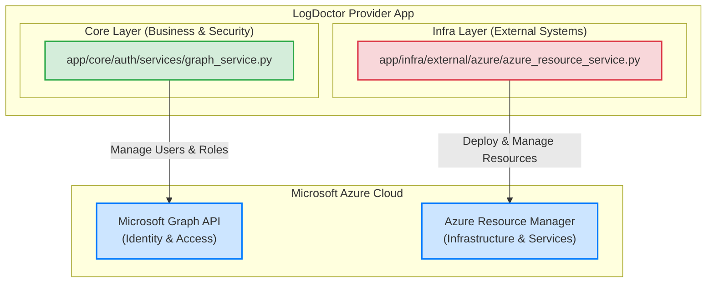
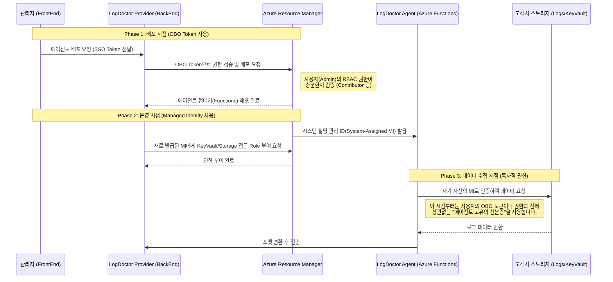
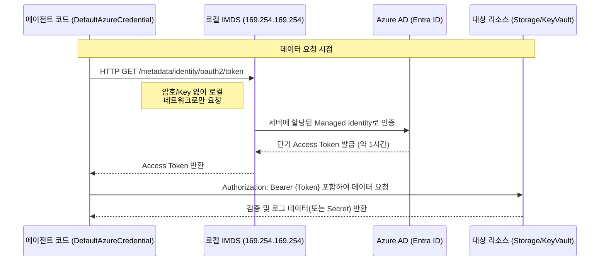

# Microsoft Graph API vs Azure Resource Manager(ARM) API

이 문서는 LogDoctor 프로젝트 내에서 사용되는 두 가지 핵심 Microsoft API의 근본적인 차이점과, 아키텍처 상 역할을 분리한 이유를 설명합니다.

## 1. 핵심 비교

| 특징                | Microsoft Graph API                            | Azure Resource Manager (ARM) API                     |
| :------------------ | :--------------------------------------------- | :--------------------------------------------------- |
| **목적**            | ID, 사용자, 권한, 업무 생산성 데이터 관리      | Azure 클라우드 인프라 자원의 프로비저닝 및 관리      |
| **관리 대상**       | 사람(User), 그룹(Group), 앱 권한(App Role)     | 서버(VM), 데이터베이스, 스토리지, 웹 앱 등           |
| **엔드포인트 URL**  | `https://graph.microsoft.com`                  | `https://management.azure.com`                       |
| **비유하자면?**     | **"회사 인사팀 (조직도, 사원증 발급)"**        | **"회사 IT 인프라팀 (서버실, 장비 지급)"**           |
| **코드 위치**       | `app/core/auth/services/graph_service.py`      | `app/infra/external/azure/azure_resource_service.py` |
| **아키텍처 레이어** | **Core (자체 사용자 DB를 대체하는 핵심 정책)** | **Infra (외부 시스템 조작을 위한 통신 계층)**        |

## 2. 아키텍처 다이어그램 (Mermaid)



## 3. API 호출 권한 (Permissions & Scopes) 심층 분석

LogDoctor는 두 가지 서로 다른 인증 흐름(Authentication Flow)을 결합하여 보안과 편의성을 모두 달성합니다. 두 API가 요구하는 보안 수준과 대상이 다르기 때문입니다.

### 3.1 Microsoft Graph API: "앱 전용 권한 (Application Permissions)"

Graph API는 조직 전체의 디렉터리 정보(사용자 목록, 역할 등)에 접근해야 합니다. 이는 특정 로그인된 사용자 한 명의 권한을 넘어서는 작업입니다.

- **토큰 종류**: **App-only Token (앱 전용 토큰)**
- **OAuth 2.0 흐름**: **Client Credentials Grant**
  - 앱 스스로가 `Client ID`와 `Client Secret` (또는 Managed Identity 인증서)을 제시하여 Azure AD로부터 자신의 신분을 증명하고 토큰을 발급받습니다.
- **요구 Scope**: `https://graph.microsoft.com/.default`
  - 앱에 사전 구성된 권한들(예: `User.Read.All`, `Directory.Read.All`)이 이 토큰 한 장에 모두 담겨 나옵니다.
- **승인 주체 (Consent)**: **Admin Consent (관리자 동의)**
  - "이 앱이 우리 회사의 모든 직원 정보를 읽어도 좋다"는 승인이므로, 일반 사용자는 불가능하며 오직 **고객사의 전역 관리자(Global Administrator)**만이 동의 버튼을 누를 수 있습니다.
- **이유 및 장점**:
  - 백그라운드 스케줄러(Cron)나, 아직 로그인하지 않은 상태에서도 앱이 자체적으로 작동하여 팀 동기화 등을 수행할 수 있습니다.

### 3.2 Azure Resource Manager: "사용자 위임 권한 (Delegated Permissions)"

반면 ARM API를 통한 인프라 자원 제어는 "앱이 멋대로" 해서는 절대 안 됩니다. 반드시 **지금 모니터 앞에 앉아 배포 버튼을 누르는 '그 사람'이 리소스 조작 권한(예: Contributor)을 가지고 있는지** 확인해야 합니다.

- **토큰 종류**: **Delegated Token (위임된 토큰) / OBO (On-Behalf-Of) Token**
- **OAuth 2.0 흐름**: **On-Behalf-Of (OBO) Flow**
  - 프론트엔드(Teams)가 획득한 사용자의 SSO 토큰(User Assertion)을 백엔드가 받습니다. 백엔드는 이 SSO 토큰을 Azure AD 서버에 제시하며, _"이 사용자를 대신해서(On-Behalf-Of) 내가 ARM API를 호출할 수 있는 새로운 토큰을 줘"_ 라고 교환합니다.
- **요구 Scope**: `https://management.azure.com/user_impersonation`
  - 말 그대로 사용자를 '대리(Impersonation)'할 수 있는 권한입니다.
- **승인 주체 (Consent)**: **User Consent (사용자 동의) + 관리자 사전 설정**
  - 앱 자체가 관리자 동의를 받았더라도, ARM API 호출은 토큰에 적힌 **그 사용자가 가진 실제 Azure 권한(Azure RBAC)**을 절대로 넘어설 수 없습니다. 사용자가 해당 구독의 권한이 없다면 토큰이 있어도 배포가 실패합니다(권한 격리).
- **이유 및 장점**:
  - 보안의 핵심 원칙인 **최소 권한의 원칙(Principle of Least Privilege)**을 준수합니다. 앱이 모든 고객의 구독을 제어할 수 있는 슈퍼 마스터키를 가지는 것이 아니라, 로그인한 관리자의 권한만큼만 제한적으로 행동합니다.

### 3.3 권한 요약 표

| 메뉴             | Microsoft Graph API (조직 데이터)            | Azure Resource Manager (인프라 자원)                                |
| :--------------- | :------------------------------------------- | :------------------------------------------------------------------ |
| **인증 주체**    | **앱 (LogDoctor Application)**               | **로그인한 사용자 (User)**                                          |
| **OAuth Flow**   | `Client Credentials` Flow                    | `On-Behalf-Of` (OBO) Flow                                           |
| **사용 Scope**   | `User.Read.All` 등 (Application)             | `user_impersonation` (Delegated)                                    |
| **권한의 한계**  | 조직 전체 데이터에 대한 정해진 권한 세트     | **해당 사용자가 Azure 포털에서 가진 실제 RBAC 권한과 100% 동일**    |
| **권한 부족 시** | 관리자의 사전 동의(Consent) 누락 시 403 에러 | 사용자의 Azure 구독 배포 권한(Contributor 등) 부족 시 403 하드 블록 |

## 4. 에이전트 리소스 접근 원리 (OBO vs Managed Identity)

"OBO 토큰으로 사용자의 RBAC 권한 스코프를 제한한다면, 배포된 에이전트는 어떻게 권한을 넘어 고객사 내부 로그를 수집할 수 있는가?"라는 의문에 대한 해답은 **인증 주체의 교대(Identity Handoff)**에 있습니다.

### 단계별 권한 전환 아키텍처



### 핵심 요약

1.  **배포 시점 (OBO Token)**: 에이전트를 "생성"하는 행위입니다. 이때는 인프라에 변화를 가하므로 반드시 조작하는 **사람(사용자)의 권한**을 엄격하게 검증해야 합니다. 이 과정이 끝나면 OBO 토큰의 수명은 끝납니다.
2.  **운영 시점 (Managed Identity)**: 배포가 완료되면 Azure는 이 에이전트에게 고유한 "시스템 가상 신분증(Managed Identity)"을 발급해 줍니다. 이후 실제 내부 시스템을 뒤지고 데이터를 가져오는 일은 사용자의 토큰이 아니라, 이 **에이전트 고유의 신분증(MI)**을 리소스(DB, 스토리지)에 제시하여 허가를 받습니다.

### 💡 "에이전트 고유의 신분증 제출"은 정확히 누가, 어떻게 하는가? (Low-Level Detail)

이 과정은 Azure Functions 내부의 **코드(SDK)와 런타임(Runtime)** 간의 협력으로 전혀 비밀번호 없이(Secret-less) 자동으로 이루어집니다.

1. **Azure SDK의 자동화 (`DefaultAzureCredential`)**: 에이전트(Python/C# 등) 코드 내부에서는 DB나 Key Vault에 접속할 때 별도의 ID/Password를 입력하지 않고, Azure SDK가 제공하는 `DefaultAzureCredential` 클래스를 그대로 사용합니다.
2. **로컬 IMDS 엔드포인트 호출**: 코드가 실행될 때 SDK는 외부 인터넷이 아니라, **Azure Functions 동작 환경 자체에 열려 있는 로컬 네트워크 주소(IMDS: Instance Metadata Service, `169.254.169.254`)**로 "나 지금 스토리지 접근해야 하니까 토큰 좀 줘" 라고 백그라운드 HTTP 요청을 던집니다.
3. **런타임의 토큰 주입**: Azure 인프라는 이 Function 코드가 **미리 발급받았던 Manged Identity 신분증**을 인식하고, Azure AD(Entra ID)와 통신하여 유효하고 짧은 수명의 일회용 토큰(Access Token)을 받아다 SDK에 전달합니다.
4. **결과 (Bearer Token)**: 최종적으로 SDK는 이 토큰을 Authorization 헤더에 실어 스토리지에 요청하고, 스토리지는 "아, 허가된 에이전트가 맞구나" 하고 데이터를 넘겨줍니다.



이를 통해 **최소 권한의 배포 안전성**(사용자가 권한이 없으면 못 만듦)과 **독자적인 서비스 운영성**(한 번 만들어지면 스스로 일함)을 동시에 달성할 수 있습니다.

## 5. 구조적 분리 (ASCII Art)

```text
+-------------------------------------------------------------+
|                     LogDoctor Domain                        |
|   (Who is this? What can they do? Should we deploy?)        |
+-------------------------------------------------------------+
     |                                          |
     V                                          |
+------------------------+                      |
|      CORE LAYER        |                      |
|  (Security & Policy)   |                      |
|                        |                      |
|  +------------------+  |                      V
|  |   GraphService   |  |              +-------------------+
|  +--------+---------+  |              |    INFRA LAYER    |
+-----------|------------+              | (External Calls)  |
            |                           |                   |
            | (User Data)               | +---------------+ |
            V                           | | AzureResource | |
+========================+              | |    Service    | |
|     Microsoft Graph    |              | +-------+-------+ |
|   (Entra ID / HR DB)   |              +---------|---------+
+========================+                        |
                                                  | (Deploy/Delete)
                                                  V
                                        +===================+
                                        |    Azure ARM      |
                                        |  (Infrastructure) |
                                        +===================+
```

## 5. 상세 설명

### 2.1 Microsoft Graph API (GraphService)

Microsoft Graph는 Entra ID(기존 Azure AD) 및 Microsoft 365 데이터를 단일 엔드포인트로 제공하는 관문입니다.

- **LogDoctor에서의 역할**: LogDoctor는 앱 내부에 별도의 사용자 테이블(User DB)을 두지 않습니다. 대신 고객사의 Entra ID를 직접 우리의 회원 테이블처럼 사용합니다.
- **주요 기능**:
  - **사용자 검색**: 회사 이메일로 직원을 검색합니다. (예: `search_users`)
  - **권한 부여**: 특정 직원에게 LogDoctor 앱의 운영자 권한(App Role)을 할당합니다. (예: `assign_user_to_app`)
  - **ID 식별**: 이메일 주소를 Graph 내부의 고유 ID(`oid`)로 변환합니다. (예: `resolve_user_ids`)
- **왜 Core 계층인가?**: 앱 사용자가 누구인지 식별하고 권한을 부여하는 행위는 애플리케이션의 가장 근본적인 **도메인 핵심 비즈니스 로직(Core Logic)**이기 때문입니다.

### 2.2 Azure Resource Manager API (AzureResourceService)

ARM(Azure Resource Manager)은 Azure 클라우드 플랫폼의 배포 및 관리 서비스입니다. 모든 Azure 리소스 생성, 업데이트, 삭제 로직이 이 계층을 통과합니다.

- **LogDoctor에서의 역할**: LogDoctor 에이전트가 설치될 고객사의 실제 클라우드 인프라 환경과 상호 작용합니다.
- **주요 기능**:
  - **권한 검증 (Azure RBAC)**: 현재 사용자가 특정 구독(Subscription)에 리소스를 배포할 수 있는 권한(Contributor 이상)을 가지고 있는지 확인합니다. (예: `check_deployment_permission`)
  - **리소스 그룹 관리**: 앱 삭제 시 생성된 Azure 리소스 그룹을 안전하게 삭제합니다. (예: `delete_resource_group`)
- **왜 Infra 계층인가?**: 실제 물리적(혹은 논리적)인 외부 시스템 리소스를 API로 조작하는 행위입니다. 비즈니스 규칙이라기보다는 **외부 DB나 외부 저장소를 조작하는 것과 같은 "인프라 통신"**에 해당하기 때문입니다.

---

## 6. 요약

이 프로젝트의 도메인 주도 설계(DDD) 철학에 따르면:

1.  **"우리의 사용자(User)가 누구인가?"**를 결정하는 코드는 아무리 외부 API(Graph)를 쓴다 해도 우리 앱의 **가장 중요한 보안 정책(Core)**이 됩니다.
2.  **"클라우드 리소스(Infra)를 어떻게 끌 것인가?"**를 결정하는 코드는 순수한 외부 통신 모듈로서 인프라 계층(`infra`)으로 격리합니다.

이러한 분리를 통해 향후 인증 방식은 유지하되 배포 환경이 다른 클라우드로 변경되거나, 반대로 인증 방식이 바뀌더라도 코드 변경의 파급(Ripple Effect)을 최소화할 수 있습니다.
