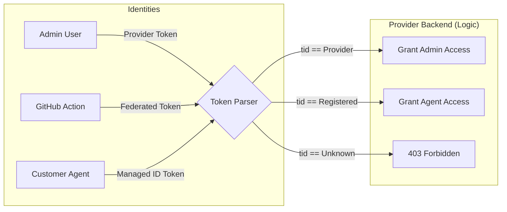

# Security Architecture: Identity & Token Ownership

본 문서는 인증 주체(Who), 소속 Entra ID(Where), 그리고 사용되는 토큰(What)을 명확히 구분하여 설계되었습니다.

---

## 1. 인증 주체별 매핑 (Identity Mapping)

| 구분 | 주체 (Who) | 소속 Entra ID | 인증 방식 (How) | 토큰 종류 (What) |
| :--- | :--- | :--- | :--- | :--- |
| **운영자 (Admin)** | Provider 관리자 | **Provider Entra ID** | 유저 로그인 (SSO/Web) | **Access Token** (User context) |
| **에이전트 (Agent)** | 고객사 Functions | **Customer Entra ID** | Managed Identity | **Managed ID Token** (App context) |
| **배포기 (CI/CD)** | GitHub Actions | **Provider Entra ID** | OIDC Federation | **Federated Token** (App context) |

---

## 2. 토큰 흐름 상세 (Token Scenarios)

### 하이레벨 아키텍처 (Identity Context)

```text
[ Provider Entra ID ]                [ Customer Entra ID (A, B, C...) ]
         |                                          |
         +--- (1) Admin User                        +--- (2) Managed Identity
         |                                          |        (Azure Functions)
         +--- (3) GitHub OIDC                       |
                  (Federated Identity)              |
                                                    |
         V (Validation)                             V (Validation)
    +-----------------------------------------------------------------------+
    |                    Log Doctor Provider Backend (ACA)                  |
    +-----------------------------------------------------------------------+
```

### 시나리오별 상세

#### (1) 운영자 접근: "우리 회사 내부용"
- **대상**: `/packages/upload`, `/packages` (목록 조회)
- **Identity**: Provider Entra ID에 등록된 사용자.
- **인증**: 브라우저를 통해 Provider Entra ID에 로그인.
- **보안**: 
    - **EasyAuth**: ACA가 우리 Entra ID 토큰인지 1차 검증.
    - **App Roles**: 백엔드 앱이 "Admin" 역할이 있는지 2차 검증(RBAC).

#### (2) 고객사 에이전트 접근: "외부 고객용"
- **대상**: `/agents/handshake`, `/packages/latest` (에이전트 업데이트용)
- **Identity**: 고객사 Azure 환경에서 생성된 **System-Assigned Managed Identity**.
- **인증**: 고객사 Function App이 Azure 내부망에서 발급받은 Managed ID 토큰 사용.
- **보안**:
    - **Audience**: 토큰의 수신처가 우리 백엔드(`Provider App ID`)인지 확인.
    - **Tenant ID (tid) Validation**: 백엔드는 토큰 내의 `tid`를 추출하여, "우리 유료 서비스에 등록된 고객사(Tenant)인가?"를 Cosmos DB에서 조회하여 인가.

#### (3) CI/CD 업로드: "자동화 배포용"
- **대상**: `/packages/upload` (GitHub에서 빌드 후 자동화)
- **Identity**: Provider Entra ID에 등록된 **Service Principal** (GitHub과 OIDC로 맺어짐).
- **인증**: GitHub Actions가 "나는 log-doctor-back의 main 브랜치다"라고 증명하고 발급받은 토큰.
- **보안**: 
    - **Federated Identity**: 비밀번호 없이 GitHub의 신원만으로 우리 Entra ID에서 권한 획득.

---

## 3. 백엔드 검증 로직 (FastAPI Pseudo Code)

백엔드에서는 들어온 토큰의 `iss`(발급자)와 `tid`(테넌트 ID)를 보고 로직을 분기합니다.

```python
async def validate_identity(token_data: dict):
    tid = token_data.get("tid")
    
    # CASE 1: 우리 회사 사람인가? (Provider Tenant)
    if tid == PROVIDER_TENANT_ID:
        if "Admin.Upload" in token_data.get("roles", []):
            return "PROVIDER_ADMIN"
            
    # CASE 2: 고객사 에이전트인가? (Customer Tenant)
    if await cosmos_db.tenants.exists(tid):
        return "REGISTERED_CUSTOMER_AGENT"
        
    raise Forbidden("Unknown or Unregistered Tenant")
```

---

## 4. 요약 다이어그램


