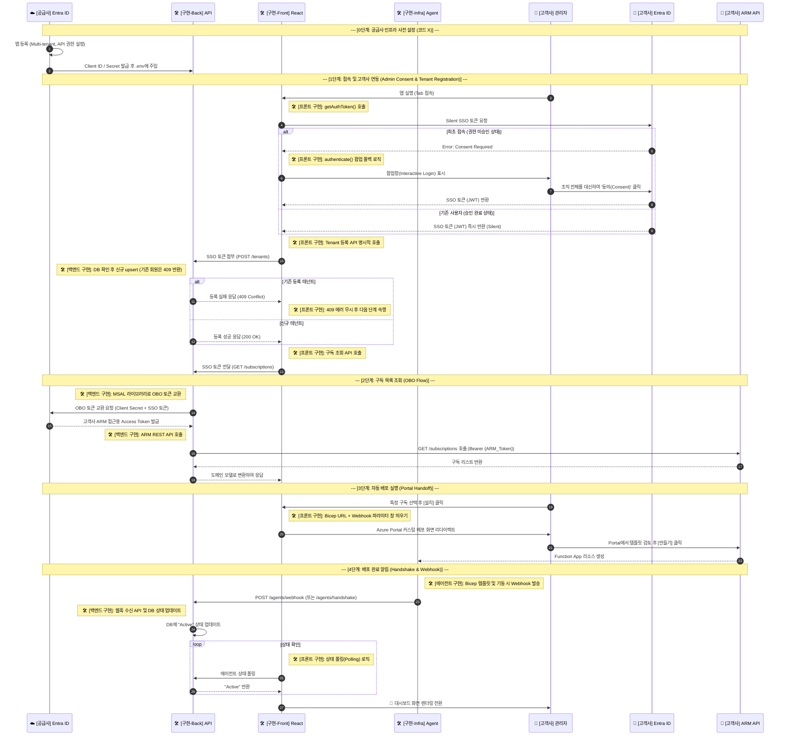

# 완벽 정리: 테넌트 명시적 등록 플로우 및 Cosmos DB 데이터 모델링

이 문서는 프론트엔드 및 백엔드 간의 **명시적 테넌트 등록 플로우 구현 내용**과 **Azure Cosmos DB 기반의 고유 식별자(PK) 및 파티션 키 할당 전략**을 이해하고 향후 개발 가이드로 삼기 위해 작성되었습니다.

---

## 1. 명시적 테넌트 등록 Flow (Explicit Registration)

이전에 고려했던 JIT(Just-In-Time)나 백엔드 콜백(Callback) 연동의 복잡성을 제거하고, **프론트엔드가 주도하는(Orchestration) 명시적 호출 구조**로 아키텍처를 전면 개편했습니다.

### 📍 Architecture Sequence Diagram



### 📍 주요 구현 변경 사항

1. **신규 라우터 개설 (`POST /api/v1/tenants`)**
   - 프론트엔드가 SSO 인증을 마치고, 백엔드에 가장 먼저 호출하는 명시적 가입 엔드포인트입니다.
   - Body 없이 오직 헤더의 `Bearer {SSO_Token}`만으로 고객사를 식별하여 저장합니다.

2. **AOP (관점 지향 프로그래밍) 원칙 적용 리팩토링**
   - **AS-IS**: `RegisterTenantUseCase` 내부에서 직접 토큰을 디코딩하고 `tid`를 꺼냈습니다. (HTTP 레이어의 침범)
   - **TO-BE**: `router.py`에서 `Depends(get_current_identity)` 미들웨어를 통해, 토큰 파싱과 검증을 라우터 진입 전에 마칩니다. UseCase는 오직 비즈니스 로직에만 집중하며, 이미 안전하게 파싱된 `Identity` 도메인 객체를 주입받아 사용합니다.
3. **불필요한 DB Transaction 감소 (Idempotency 설계)**
   - 이미 가입된 고객사가 새로고침 등으로 `POST /tenants`를 재호출할 경우, 불필요하게 DB를 `upsert` 하지 않도록 방어했습니다. DB에 `tenant_id`가 이미 존재한다면 즉시 **`409 Conflict` (ConflictException)** 예외를 던집니다.
   - 이로 인해 프론트엔드는 `200 OK` 또는 `409 Conflict` 두 가지 응답 모두를 정상 접속으로 처리하고, 후속 로직(구독 조회)을 안전하게 이어갈 수 있습니다.

---

## 2. Azure Cosmos DB 데이터 모델링 전략 파헤치기

개발을 진행하며, MongoDB나 RDBMS에 익숙한 상태에서 Azure Cosmos DB(NoSQL)의 `id` 속성 할당 방식에 혼동이 있을 수 있습니다. 시스템에 적용된 핵심 모델링 기준은 다음과 같습니다.

### 📍 MongoDB `ObjectId` vs Cosmos DB `id`

- **MongoDB**: 문서를 삽입할 때 `_id`를 비워두면 DB 엔진이 자체적으로 **자동 할당(Auto Generation)** 해주는 `ObjectId` 매직이 존재합니다.
- **Cosmos DB**: 데이터 삽입 시 필수 속성인 `id`를 DB 엔진이 만들어주지 않습니다. **반드시 애플리케이션(Python 코드) 단에서 명시적으로 유니크한 문자열을 조립하거나 생성(uuid 등)**해서 주입해야만 합니다.

### 📍 모델별 PK(고유 식별자) 및 Partition Key 할당 가이드

B2B SaaS 아키텍처에서 데이터 조회 속도 향상과 논리적 격리를 위해 **모든 데이터 컨테이너의 파티션 키(Partition Key)는 강력하게 `tenant_id` 로 통일**합니다.

#### 1) 1:1 최상위 엔티티: `Tenant` 모델

테넌트 עצם(Entity)은 고객사 그 자체이며, 1:1로 유일하게 매칭되는 루트(Root) 엔티티입니다.

> **Why?** 랜덤한 UUID를 새로 만들어서 `id`에 넣는 대신, Entra ID가 이미 부여한 전 세계 유일한 식별자인 `tid(Tenant ID)` 자체를 Primary Key인 `id`에 매핑하는 것이 **Natural Key 전략**상 가장 빠르고 완벽한 1:1 맵핑 방법입니다.

```python
def create(tenant_id: str) -> "Tenant":
    return Tenant(
        id=tenant_id,         # Cosmos DB 필수 고유 식별자
        tenant_id=tenant_id,  # (동시에) 논리적 파티션 키
        is_active=False,
        ...
    )
```

이와 같이 파티션 키와 식별자가 완벽하게 일치하는 경우를 **Point Read** 구조라 하며 조회 속도가 가장 빠릅니다. (e.g. `read_item(item=tid, partition_key=tid)`)

#### 2) 1:N 하위 엔티티: `Agent` 모델 (및 기타 모델들)

한 테넌트(고객사) 아래에는 여러 구독이나, 여러 개의 에이전트 리소스가 생길 수 있습니다 (1:N 관계).
이때 `id`를 단순히 `tenant_id`로 주면 데이터 중복에 의한 덮어쓰기(Collision) 재앙이 일어납니다.

이런 하위 리소스들은 다음과 같이 **복합 키(Composite Key)** 나 **UUID 조합**을 사용해 애플리케이션 단에서 만들어 줍니다.

```python
def create(tenant_id: str, agent_id: str, ...) -> "Agent":
    return Agent(
        id=f"{tenant_id}:{agent_id}",  # 복합 고유 키 생성 (예: "aaa-bbb:function-1")
        tenant_id=tenant_id,           # 논리적 격리를 위한 파티션 키
        ...
    )
```

**[1:N 모델 생성 규칙 요약]**

- **파티션 키 (`tenant_id`)**: 조회 범위를 좁히기 위해 언제나 **`tenant_id`**를 사용.
- **고유 식별자 (`id`)**: 같은 파티션 안에서 겹치면 안 되므로, **`{tenant_id}:{개별_유니크_값}`** 또는 순수 **`uuid.uuid4().hex`** 를 백엔드 코드에서 직접 생성해서 매핑.
