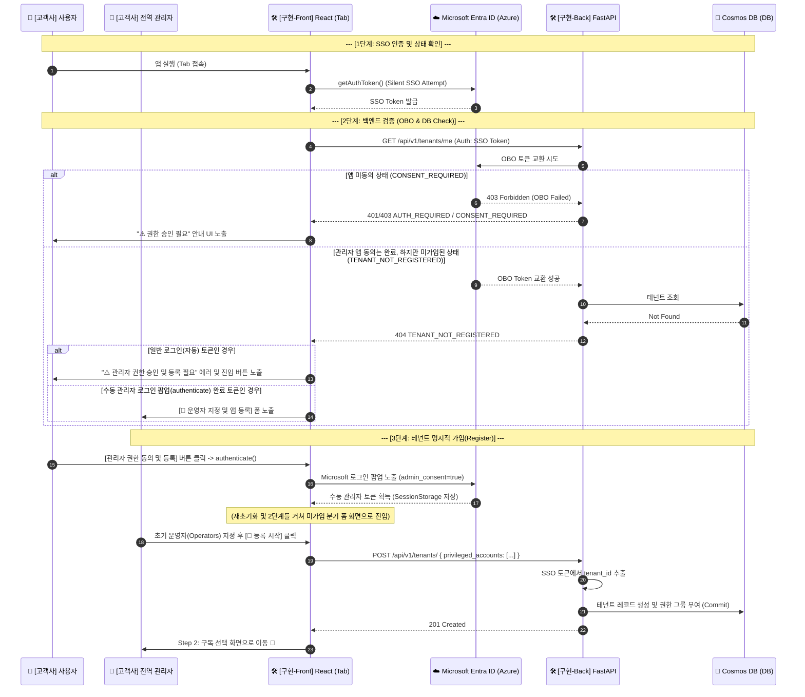
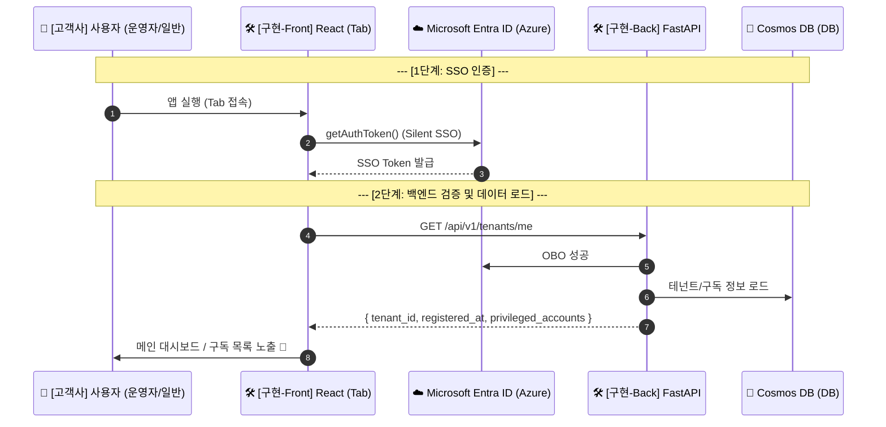
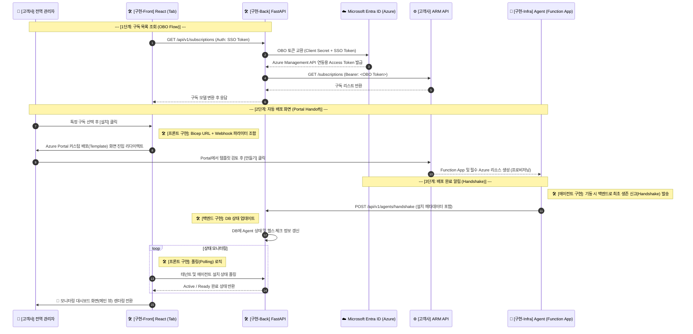

# 완벽 정리: 테넌트 명시적 등록 플로우 및 Cosmos DB 데이터 모델링

이 문서는 프론트엔드 및 백엔드 간의 **명시적 테넌트 등록 플로우 구현 내용**과 **Azure Cosmos DB 기반의 고유 식별자(PK) 및 파티션 키 할당 전략**을 이해하고 향후 개발 가이드로 삼기 위해 작성되었습니다.

---

## 1. 명시적 테넌트 등록 Flow (Explicit Registration)

### 📍 Architecture Sequence Diagram

#### 시나리오 A: 신규 테넌트 온보딩 (최초 등록 및 승인)



#### 시나리오 B: 기존 등록 테넌트 접속 (정상 서비스 이용)



### 📍 주요 구현 변경 사항

1. **선-동의 후-등록 (Consent-First Gate) 도입**
   - **AS-IS**: SSO 인증 직후 바로 `POST /tenants`를 호출하여 DB에 생성했습니다.
   - **TO-BE**: `GET /tenants/me`를 먼저 호출하여 백엔드가 OBO 토큰 교환을 통해 **조직 전체 동의(Admin Consent)** 여부를 먼저 검증합니다. 동의가 확인된 상태에서만 명시적인 등록(`POST /tenants`)이 가능하도록 게이트를 강화했습니다.

2. **최소 권한의 법칙 (Least Privilege) 적용**
   - 사용자가 로그인 팝업에서 승인해야 하는 권한(Scope)에서 `Directory.Read.All` 위임 권한을 삭제했습니다.
   - 대신, 디렉터리 조회가 필요한 로직은 백엔드에서 **앱 전용 권한(Application Permission)**을 사용하여 안전하게 수행하도록 분리했습니다.

3. **중단(Stop-on-Error) 및 가이드 Flow 강화**
   - MFA 인증이 필요하거나 동의가 없는 상황에서 후속 API(Subscriptions)가 호출되지 않도록 안정적인 중단 로직을 추가했습니다.
   - 인증 에러 발생 시 사용자 유형(일반/관리자)에 맞춰 관리자 연락처 리스트 또는 동의 버튼을 동적으로 노출합니다.

4. **신규 라우터 개설 (`POST /api/v1/tenants/`)**
   - 프론트엔드가 모든 권한 검증을 마치고, 백엔드에 테넌트 가입을 최종 확정하는 엔드포인트입니다.
   - **보안 강화**: `tenant_id`를 본문에 포함하지 않고, 백엔드에서 SSO 토큰을 통해 직접 추출하여 무결성을 보장합니다.
   - **멱등성 보장**: 이미 가입된 고객사가 재호출할 경우 기존 정보를 반환하거나 적절히 처리하여 안전하게 동작합니다.

---

## 2. Azure Cosmos DB 데이터 모델링 전략 파헤치기

개발을 진행하며, MongoDB나 RDBMS에 익숙한 상태에서 Azure Cosmos DB(NoSQL)의 `id` 속성 할당 방식에 혼동이 있을 수 있습니다. 시스템에 적용된 핵심 모델링 기준은 다음과 같습니다.

### 📍 MongoDB `ObjectId` vs Cosmos DB `id`

- **MongoDB**: 문서를 삽입할 때 `_id`를 비워두면 DB 엔진이 자체적으로 **자동 할당(Auto Generation)** 해주는 `ObjectId` 매직이 존재합니다.
- **Cosmos DB**: 데이터 삽입 시 필수 속성인 `id`를 DB 엔진이 만들어주지 않습니다. **반드시 애플리케이션(Python 코드) 단에서 명시적으로 유니크한 문자열을 조립하거나 생성(uuid 등)**해서 주입해야만 합니다.

### 📍 모델별 PK(고유 식별자) 및 Partition Key 할당 가이드

B2B SaaS 아키텍처에서 데이터 조회 속도 향상과 논리적 격리를 위해 **모든 데이터 컨테이너의 파티션 키(Partition Key)는 강력하게 `tenant_id` 로 통일**합니다.

#### 1) 1:1 최상위 엔티티: `Tenant` 모델

테넌트 עצם(Entity)은 고객사 그 자체이며, 1:1로 유일하게 매칭되는 루트(Root) 엔티티입니다.

> **Why?** 랜덤한 UUID를 새로 만들어서 `id`에 넣는 대신, Entra ID가 이미 부여한 전 세계 유일한 식별자인 `tid(Tenant ID)` 자체를 Primary Key인 `id`에 매핑하는 것이 **Natural Key 전략**상 가장 빠르고 완벽한 1:1 맵핑 방법입니다.

```python
def create(tenant_id: str) -> "Tenant":
    return Tenant(
        id=tenant_id,         # Cosmos DB 필수 고유 식별자
        tenant_id=tenant_id,  # (동시에) 논리적 파티션 키
        is_active=False,
        ...
    )
```

이와 같이 파티션 키와 식별자가 완벽하게 일치하는 경우를 **Point Read** 구조라 하며 조회 속도가 가장 빠릅니다. (e.g. `read_item(item=tid, partition_key=tid)`)

#### 2) 1:N 하위 엔티티: `Agent` 모델 (및 기타 모델들)

한 테넌트(고객사) 아래에는 여러 구독이나, 여러 개의 에이전트 리소스가 생길 수 있습니다 (1:N 관계).
이때 `id`를 단순히 `tenant_id`로 주면 데이터 중복에 의한 덮어쓰기(Collision) 재앙이 일어납니다.

이런 하위 리소스들은 다음과 같이 **복합 키(Composite Key)** 나 **UUID 조합**을 사용해 애플리케이션 단에서 만들어 줍니다.

```python
def create(tenant_id: str, agent_id: str, ...) -> "Agent":
    return Agent(
        id=f"{tenant_id}:{agent_id}",  # 복합 고유 키 생성 (예: "aaa-bbb:function-1")
        tenant_id=tenant_id,           # 논리적 격리를 위한 파티션 키
        ...
    )
```

**[1:N 모델 생성 규칙 요약]**

- **파티션 키 (`tenant_id`)**: 조회 범위를 좁히기 위해 언제나 **`tenant_id`**를 사용.
- **고유 식별자 (`id`)**: 같은 파티션 안에서 겹치면 안 되므로, **`{tenant_id}:{개별_유니크_값}`** 또는 순수 **`uuid.uuid4().hex`** 를 백엔드 코드에서 직접 생성해서 매핑.

---

## 3. 에이전트 등록 전략: Passive vs Active Tracking

에이전트 배포 시 공급사가 배포 과정을 얼마나 능동적으로 추적할지에 따라 두 가지 전략이 존재합니다.

### 1) Passive Registration (현재 구현 방식)

- **흐름**: 사용자가 Azure Portal로 떠난 후, 백엔드는 에이전트가 설치되어 `/handshake`를 호출할 때까지 기다립니다.
- **장점**: 구현이 단순하며, 중도 포기한 사용자의 "유령 데이터"가 DB에 쌓이지 않아 관리 부담이 적습니다.
- **단점**: 사용자가 포털에서 배포를 시작했는지 백엔드가 즉시 알 수 없어, 대시보드에서 "배포 중"이라는 실시간 피드백을 주기 어렵습니다.

### 2) Pre-registration (운영 관리 강화 방식)

- **흐름**: 사용자가 [설치]를 클릭하는 순간 백엔드가 `PENDING` 상태의 에이전트 레코드를 먼저 생성하고 포털로 보냅니다.
- **장점**: 공급사(Admin)가 "동의는 했으나 설치는 안 한" 이탈 사용자를 추적할 수 있어 고객 관리(CRM)에 효율적입니다.
- **단점**: 설치를 취소한 경우 `PENDING` 데이터가 남으므로 주기적인 Cleanup 로직이 필요합니다.

> **[결정]**: 현재는 시스템의 안정성과 단순함을 위해 **Passive Registration** 방식을 채택하고 있으며, 핸드셰이크 시점에 `INITIALIZING` 상태로 생성됩니다. 향후 운영자 대시보드 기능이 강화될 때 Pre-registration으로 확장할 예정입니다.

---

## 4. 구독 선택 및 에이전트 배포 Flow (Post-Registration)

테넌트 명시적 등록(Register)이 끝난 후, 실제 로그닥터 에이전트 인프라를 고객사 측에 배포하고 연동하는 과정입니다.


