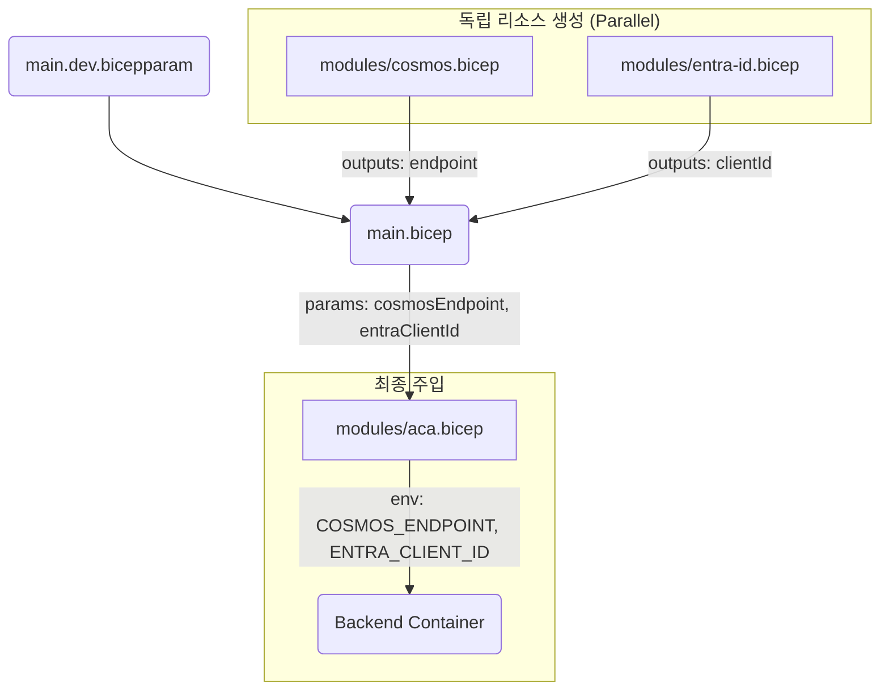

# Log Doctor Infrastructure

이 디렉토리는 Log Doctor 프로젝트의 Azure 인프라 정의(Bicep)를 포함합니다.

## 사전 준비 (Prerequisites)

1. **Azure CLI 설치 및 로그인**: `az login`
2. **권한 확인**: 사용자는 리소스 그룹 생성 권한 및 Entra ID 앱 등록 권한이 있어야 합니다.

## 배포 흐름 (Deployment Flow)

전체 배포는 `main.bicep`을 중심으로 다음과 같은 흐름으로 진행됩니다:

1. **인프라 설정 (`bicepconfig.json`)**: Microsoft Graph 확장을 활성화하여 Bicep이 직접 Entra ID와 통신할 수 있게 합니다.
2. **독립 리소스 병렬 배포**:
   - **Log Analytics (LAW)**: 로그 수집용
   - **Container Registry (ACR)**: 컨테이너 이미지 저장소
   - **Cosmos DB**: 데이터베이스 (Serverless)
   - **Entra ID App**: OAuth2 인증을 위한 앱 등록
3. **의존성 리소스 배포 (ACA)**:
   - 위 리소스들이 모두 준비되면 **Azure Container Apps (ACA)** 배포가 시작됩니다.
   - 이때 Entra ID의 `ClientId`와 Cosmos DB 엔드포인트 등이 환경 변수로 자동 주입됩니다.

## 배포 명령어

### 1. 리소스 그룹 생성 (최초 1회)

```bash
az group create --name logdoctor-dev-rg-test --location koreacentral
```

### 2. Bicep 배포 (Dev 환경)

```bash
# 배포 이름에 타임스탬프를 붙이면 이전 배포가 진행 중이어도 충돌 없이 실행 가능합니다.
DEPLOY_NAME="main-$(date +%Y%m%d-%H%M%S)"

az deployment group create \
  --name $DEPLOY_NAME \
  --resource-group logdoctor-dev-rg \
  --template-file infra/provider/provider-setup.json \
  --parameters infra/provider/provider-setup.dev.bicepparam
```

> [!TIP]
> **"DeploymentActive" 에러 해결 방법**
> 만약 "기존 배포가 여전히 활성 상태이므로 저장할 수 없습니다"라는 오류가 발생하면 다음 중 하나를 시도하세요:
>
> 1. 위의 예시처럼 `--name` 뒤에 고유한 이름(타임스탬프 등)을 주어 새로운 배포로 실행합니다.
> 2. `az deployment group cancel --resource-group [그룹명] --name [배포명]` 명령어로 진행 중인 배포를 취소합니다.
> 3. Azure Portal의 리소스 그룹 > **배포(Deployments)** 메뉴에서 직접 '취소'를 클릭합니다.

> [!TIP]
> **What-If 확인**: 실제 배포 전에 `--confirm-with-what-if` 옵션을 추가하여 변경 사항을 미리 확인할 수 있습니다.

## 리소스 구성

- `main.bicep`: 전체 인프라 통합 및 오케스트레이션
- `modules/`: 각 서비스별 상세 정의 (ACA, ACR, Cosmos, LAW, Entra ID)
- `bicepconfig.json`: Microsoft Graph 확장 설정

## 환경 변수 적용 흐름 (Environment Variable Flow)

Bicep을 처음 사용하시는 분들을 위해, 각 모듈에서 생성된 값들이 어떻게 최종적으로 ACA(Container App)의 환경 변수로 주입되는지 설명합니다.

### 1. 데이터 흐름도



### 2. 단계별 상세 설명

1. **파라미터 입력 (`.bicepparam`)**:
   - `env` ('dev' 등) 같은 설정값이 `main.bicep`으로 전달됩니다.
2. **리소스 생성 및 데이터 추출 (`output`)**:
   - Cosmos DB가 생성되면 Azure가 자동으로 엔드포인트 URL을 할당합니다.
   - `modules/cosmos.bicep`은 이 값을 `output cosmosEndpoint string` 코드를 통해 밖으로 내보냅니다.
3. **데이터 전달 (`params`)**:
   - `main.bicep`에서는 `cosmos.outputs.cosmosEndpoint`와 같은 문법으로 이 값들을 받아서, `aca` 모듈의 파라미터로 다시 꽂아줍니다.
4. **컨테이너 환경 변수 적용 (`env`)**:
   - `modules/aca.bicep` 내부에서 전달받은 파라미터를 ACA의 `template.containers.env` 설정에 매핑합니다.
   - 이 과정이 완료되면 백엔드 코드에서 해당 이름으로 시스템 환경 변수를 읽어 사용할 수 있게 됩니다.

### 3. Bicep의 핵심 (Implicit Dependency)

Bicep은 사용자가 직접 실행 순서를 지정하지 않아도, `outputs`를 참조하는 코드가 있으면 **자동으로 의존성 트리**를 그립니다. 즉, Cosmos DB의 엔드포인트를 ACA가 사용하도록 코드가 작성되어 있다면, Bicep은 알아서 Cosmos DB를 먼저 만들고 그 값이 나올 때까지 기다렸다가 ACA 배포를 시작합니다.
